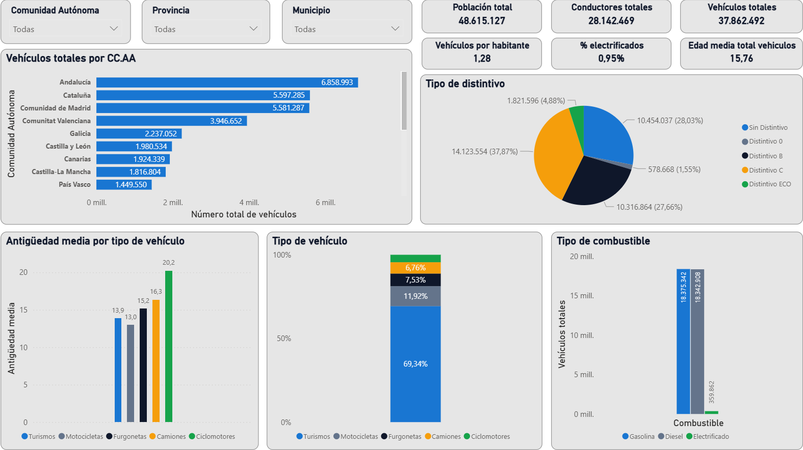
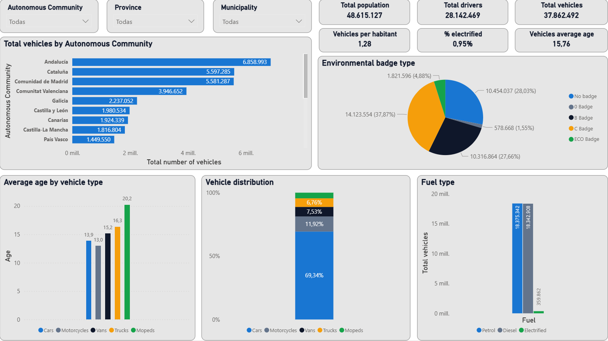

Contenidos / Contents:

- [Spanish version](#spanish-version)
- [English version](#english-version)

## Spanish version ### 

## [Dashboard interactivo](https://app.powerbi.com/view?r=eyJrIjoiYjgxYzFmNWMtMmM2NS00MjMwLWI4OTktYWI5M2Q4OTViODg3IiwidCI6IjMxNjUxZjMwLWUwZTktNDMxYy04YzVlLWY1YzQ5MTMwZjY2MiIsImMiOjh9)

Los datos públicos contienen información valiosa, pero sin un tratamiento analítico adecuado resultan difíciles de interpretar y utilizar para la toma de decisiones. El parque automovilístico español es un buen ejemplo: millones de registros distribuidos territorialmente que, sin modelado ni visualización estructurada, no permiten identificar patrones relevantes. 

Este proyecto analiza el parque de vehículos en España en **2024** con el objetivo de extraer insights estratégicos sobre distribución territorial, composición por tipo de vehículo, envejecimiento del parque y grado de electrificación. 

 

## Impacto del análisis: 
Este dashboard permite: 
- Detectar desequilibrios territoriales en el parque automovilístico. 
- Evaluar el ritmo real de transición hacia movilidad sostenible. 
- Identificar el envejecimiento estructural del parque español. 
- Servir como base para análisis predictivos o estudios de política pública. 

## Objetivos 
- Analizar la distribución del parque automovilístico por Comunidad Autónoma. 
- Evaluar la composición por tipo de vehículo. 
- Medir el grado de electrificación del parque. 
- Estudiar la edad media de los vehículos y sus implicaciones. 
- Construir un dashboard interactivo que permita explorar los datos de forma intuitiva. 

## Fuente de datos 
Los datos han sido obtenidos en formato Excel a través de la web oficial de la [DGT](https://www.dgt.es/menusecundario/dgt-en-cifras/dgt-en-cifras-resultados/dgt-en-cifras-detalle/Datos-municipales-informacion-general-2024/). Contienen información sobre:

- La composición del parque de vehículos en España 
- La antigüedad de los vehículos 
- El censo de conductores 
- La cantidad de vehículos por Comunidad Autónoma, provincia y municipio 
- La distribución de vehículos según los distintos tipos de distintivos ambientales 
- El total de vehículos y su clasificación por tipo 

## Visualizaciones 
- **KPIs**: Nº total de vehículos, nº total de conductores, porcentaje de vehículos electrficados, vehículos por habitante, edad media total de vehículos 
- **Gráfico de barras horizontales**: Número total de vehículos por Comunidad Autónoma 
- **Gráfico de barras verticales**: Antigüedad promedio por tipo de vehículo 
- **Gráfico de barras horizontales apiladas**: Distribución de tipos de vehículos 
- **Gráfico de tarta**: Distribución de distintivos ambientales 
- **Gráfico de barras verticales**: Distribución de tipo de combustible 
- **Segmentadores**: Comunidad Autónoma, provincia y municipio 

## Metodología 
El desarrollo del proyecto incluyó: 
- Limpieza y estandarización de nombres geográficos. 
- Modelado relacional en Power BI. 
- Creación de medidas DAX para agregaciones y KPIs. 
- Diseño orientado a usabilidad y claridad ejecutiva. 

## Insights Clave 
- El 69% del parque está compuesto por turismos, lo que confirma un modelo de movilidad centrado en vehículo privado ligero. 
- La electrificación (<1%) muestra una adopción todavía marginal, lejos de los objetivos europeos de descarbonización. 
- La edad media superior a 15 años indica un parque envejecido, con impacto potencial en emisiones y seguridad vial. 
- Andalucía, Cataluña y Madrid concentran el mayor volumen absoluto de vehículos, evidenciando desequilibrios territoriales. 

### Conclusión
El análisis revela una transición energética más lenta de lo esperado y una estructura de parque envejecida, lo que plantea desafíos significativos para las políticas públicas de movilidad sostenible y renovación del parque. 

## Herramientas utilizadas 
- Power BI Desktop 
- DAX 
- Excel 

## Archivos 
- `data/`: dataset utilizado 
- `docs/`: paleta de colores utilizada para el dashboard 
- `images/`: capturas de pantalla del dashboard 
- `vehiculos_españa_dashboard.pbit`: plantilla del dashboard **sin datos** 
- `vehiculos_españa_dashboard.pbix`: versión completa del dashboard lista para abrir (1,6 MB, datos públicos) 

## Notas 
- Los valores mostrados corresponden a promedios y totales agregados. 
- El análisis depende de la calidad y actualización de los datos publicados por la DGT.

## English version

## [Interactive Dashboard](https://app.powerbi.com/view?r=eyJrIjoiYjgxYzFmNWMtMmM2NS00MjMwLWI4OTktYWI5M2Q4OTViODg3IiwidCI6IjMxNjUxZjMwLWUwZTktNDMxYy04YzVlLWY1YzQ5MTMwZjY2MiIsImMiOjh9)

Public data contains valuable information, but without proper analytical treatment it is difficult to interpret and use for decision-making. The Spanish vehicle fleet is a clear example: millions of territorially distributed records that, without structured modeling or visualization, make it hard to identify meaningful patterns.  

This project analyzes Spain’s vehicle fleet in **2024** with the objective of extracting strategic insights about territorial distribution, vehicle type composition, fleet aging, and electrification levels.  

## Analysis Impact
This dashboard allows you to:

- Detect territorial imbalances in the vehicle fleet.  
- Evaluate the real pace of transition toward sustainable mobility.  
- Identify structural aging within the Spanish fleet.  
- Serve as a basis for predictive analyses or public policy studies.

## Objectives
- Analyze the distribution of the vehicle fleet by Autonomous Community.  
- Evaluate the composition by vehicle type.  
- Measure the level of electrification.  
- Study the average age of vehicles and its implications.  
- Build an interactive dashboard that allows intuitive data exploration.

## Data Source
The data was obtained in Excel format from the official website of the [DGT](https://www.dgt.es/menusecundario/dgt-en-cifras/dgt-en-cifras-resultados/dgt-en-cifras-detalle/Datos-municipales-informacion-general-2024/). It contains information about:

- The composition of the vehicle fleet in Spain  
- Vehicle age  
- Driver census  
- Number of vehicles by Autonomous Community, province, and municipality  
- Distribution of vehicles according to environmental label types  
- Total vehicles and classification by type

## Visualizations
- **KPIs**: Total number of vehicles, total number of drivers, percentage of electrified vehicles, vehicles per inhabitant, overall average vehicle age  
- **Horizontal bar chart**: Total vehicles by Autonomous Community  
- **Vertical bar chart**: Average age by vehicle type  
- **Stacked horizontal bar chart**: Distribution of vehicle types  
- **Pie chart**: Environmental label distribution  
- **Vertical bar chart**: Fuel type distribution  
- **Slicers**: Autonomous Community, province, and municipality

## Methodology
The project development included:

- Cleaning and standardizing geographic names  
- Relational modeling in Power BI  
- Creation of DAX measures for aggregations and KPIs  
- Dashboard design focused on usability and executive clarity

## Key Insights
- 69% of the fleet consists of passenger cars, confirming a mobility model centered on private light vehicles.  
- Electrification (<1%) remains marginal, far from European decarbonization targets.  
- An average age over 15 years indicates an aging fleet, with potential impacts on emissions and road safety.  
- Andalusia, Catalonia, and Madrid concentrate the highest absolute number of vehicles, highlighting territorial imbalances.

### Conclusion
The analysis reveals a slower-than-expected energy transition and an aging fleet structure, posing significant challenges for sustainable mobility policies and fleet renewal.

## Tools Used
- Power BI Desktop  
- DAX  
- Excel

## Files
- `data/`: dataset used  
- `docs/`: color palette used for the dashboard  
- `images/`: dashboard screenshots  
- `vehiculos_españa_dashboard.pbit`: dashboard template **without data**  
- `vehiculos_españa_dashboard.pbix`: full dashboard version ready to open (1.6 MB, public data)

## Notes
- Displayed values correspond to aggregated totals and averages.  
- The analysis depends on the quality and updates of the data published by the DGT.
